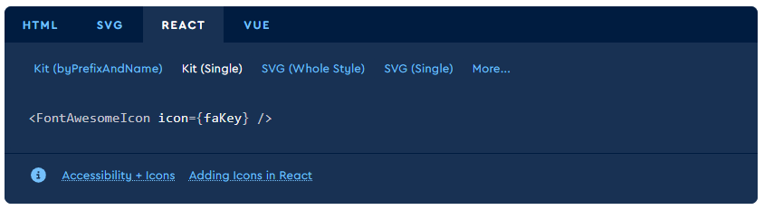

### Docs chính thức của Fontawesome để import, install và setting trong react
https://docs.fontawesome.com/v6/web/use-with/react



### Docs chính thức của Toastify
https://www.npmjs.com/package/react-toastify

https://www.pinterest.com/

https://www.skypack.dev/view/react-cssfx-loading

### Docs ```createAsyncThunk```:
https://redux-toolkit.js.org/api/createAsyncThunk

NGUỒN LOGIN:
https://www.webskilllab.com/javascript/authentication-dang-nhapdang-xuat-trong-react

---

POST : nên dùng để tạo tài nguyên , chỉnh sửa collection .

PUT : dùng để update tài nguyên , các tài nguyên riêng lẻ .

PATCH : dùng update 1 phần tài nguyên , nhanh hơn PUT.

---

## Axios với React

Axios là một HTTP client được viết dựa trên Promises được dùng để hỗ trợ cho việc xây dựng các ứng dụng API từ đơn giản đến phức tạp và có thể được sử dụng cả ở trình duyệt hay Node.js.

### Đặc điểm Axios

1. Tạo XMLHttpRequests từ trình duyệt
2. Thực hiện các http request từ node.js
3. Hỗ trợ Promise API
4. chặn request và response
5. Chuyển đổi dữ liệu request và response
6. Hủy requests
7. Tự động chuyển đổi về dữ liệu JSON
8. Hỗ trợ phía client để chống lại XSRF


1. baseURL: nếu bạn chỉ định một base URL, nó sẽ được đính vào trước bất cứ một URL tương đối nào mà bạn sử dụng.
2. headers: một object gồm các cặp key/value có thể gửi trong header của request.
3. params: một object gồm các cặp key/value mà sẽ được serialize và đính vào URL dưới dạng một query string.

---
##  Vấn đề: JSX sinh ra kiểu gì?
```tsx
<div>Hello</div>
```

=> Thì **TypeScript** hiểu đây là **một phần tử React**.
Kiểu dữ liệu thật của nó là:

```ts
JSX.Element
```


###  `Element` vs `JSX.Element` khác nhau chỗ nào?

| Kiểu          | Nguồn gốc                | Dùng ở đâu                       | Mô tả                                                                           |
| ------------- |--------------------------| -------------------------------- | ------------------------------------------------------------------------------- |
| `Element`     | DOM API của trình duyệt **"DOM type"** | TypeScript / JavaScript gốc      | Là **phần tử HTML thật** trong DOM (kiểu như `HTMLElement`, `SVGElement`, v.v.) |
| `JSX.Element` | React định nghĩa         | React / TypeScript (JSX context) | Là **phần tử React** được tạo khi bạn viết `<div>...</div>`                     |

---

Nếu bạn muốn linh hoạt hơn, thay vì chỉ `JSX.Element`, có thể dùng:
```ts
categoryDisplay: React.ReactNode
```
Vì `React.ReactNode` bao gồm:
* `JSX.Element`
* `string`
* `number`
* `boolean`
* `null`
* `undefined`
* `React.Fragment`
* mảng các phần tử React,...

Đây là kiểu được dùng **chuẩn nhất trong React**, ví dụ trong props `children`.

### 🔹 Tóm lại:

| Mục đích                           | Nên dùng kiểu   |
| ---------------------------------- | --------------- |
| Chỉ nhận JSX                       | `JSX.Element`   |
| Nhận cả text / fragment / mảng JSX |`React.ReactNode`|
| Không dùng trong React             | `Element`       |

---
Để trả lời câu hỏi của bạn một cách rõ ràng, mình sẽ giải thích từng phần một:

---

### 1. **DOM là gì?**

**DOM (Document Object Model)** là một **mô hình dữ liệu dạng cây** đại diện cho cấu trúc của một trang web (HTML, XML).

* Mỗi **thẻ HTML** trở thành một **node** trong cây DOM.
* JavaScript có thể tương tác với DOM để **thay đổi nội dung, cấu trúc, hay style** của trang web **mà không cần reload trang**.

Ví dụ:

```html
<div id="root">
  <h1>Hello World</h1>
</div>
```

Trong DOM, `div#root` là node cha, `h1` là node con.

### 2. **DOM trong React**

React sử dụng **Virtual DOM (DOM ảo)** chứ không thao tác trực tiếp lên **real DOM**.

* **Virtual DOM:** là một bản sao nhẹ của DOM thực tế, nằm trong bộ nhớ.
* React **so sánh** Virtual DOM với DOM trước đó để tìm ra **những thay đổi cần thiết** (diffing algorithm).
* Sau đó, React **cập nhật chỉ những phần thay đổi** trên DOM thực tế, thay vì render lại toàn bộ trang.

Ví dụ:

```jsx
const [count, setCount] = React.useState(0);

return (
  <div>
    <p>{count}</p>
    <button onClick={() => setCount(count + 1)}>Tăng</button>
  </div>
);
```

Khi `count` thay đổi, React:

1. Cập nhật Virtual DOM.
2. So sánh với Virtual DOM cũ.
3. Chỉ update `<p>` trong DOM thật, không render lại `<button>`.

### 3. **Tại sao phải có DOM (và Virtual DOM)?**

* **DOM thực sự**: cần để trình duyệt hiển thị nội dung và cấu trúc web.
* **Virtual DOM trong React**:

    * **Hiệu suất:** giảm số lần thao tác trực tiếp với DOM, tránh re-render toàn bộ trang.
    * **Dễ quản lý state:** React tự động cập nhật giao diện dựa trên dữ liệu (`state`/`props`).
    * **Code gọn gàng hơn:** bạn chỉ định giao diện mong muốn, React lo phần tối ưu update.

### 4. **Tóm tắt**

| Khái niệm   | Vai trò chính                                                         |
| ----------- | --------------------------------------------------------------------- |
| DOM thực tế | Hiển thị trang web, cho phép JS thao tác trực tiếp.                   |
| Virtual DOM | Bản sao DOM trong React để tối ưu cập nhật giao diện.                 |
| Tại sao cần | Giúp render nhanh, tránh thao tác DOM tốn kém, quản lý state dễ dàng. |

---

### 🔹 1. `slice(start, end)` hoạt động theo quy tắc **“lấy từ start đến trước end”**

* `start`: vị trí bắt đầu (tính từ 0)
* `end`: **vị trí dừng**, nhưng **không bao gồm** phần tử ở vị trí đó
  → nên **không cần trừ 1**, vì nó **tự dừng trước end** rồi.

---

### 1. `<Link>` trong React Router

* `<Link>` là component của **react-router-dom**, thay thế cho `<a>`.
* Ví dụ:


 ```tsx
 import { Link } from "react-router-dom";


 <Link to="/login">Đăng nhập</Link>
 ```
* Khi click, React Router **chỉ đổi component bên trong** mà không reload trang.
* Ưu điểm: nhanh hơn, giữ nguyên state, không gọi lại server tải cả trang.


---
### 2. `useNavigate` trong React Router

* Dùng khi bạn muốn **chuyển trang bằng code** (không cần người dùng click).
* Ví dụ: sau khi đăng ký thành công thì tự động chuyển sang trang login:


 ```tsx
 import { useNavigate } from "react-router-dom";


 const Register = () => {
   const navigate = useNavigate();


   const handleRegister = () => {
     // gọi API đăng ký ở đây
     // nếu thành công:
     navigate("/login"); // tự động chuyển đến trang login
   };


   return (
     <button onClick={handleRegister}>Đăng ký</button>
   );
 };
 ```
* `navigate("/login")` = giống như click `<Link to="/login" />`, nhưng được thực hiện bằng **JS code** thay vì user click.


---


* **`<Link>`** → Dùng cho liên kết nội bộ khi người dùng **click**.
* **`navigate("/path")`** → Dùng để điều hướng **bằng code** (ví dụ: sau khi đăng nhập/đăng ký thành công thì tự động chuyển trang).


const tests = [{id: 1}, {id: 2}, {id: 3}];
console.log(tests.length);      // 3
console.log(tests[tests.length - 1]); // tests[2] → {id: 3}


=> phần tử cuối cùng

3️⃣ Luồng sử dụng điển hình


Người dùng click vào “Sửa” một bài test.

- Dispatch:  dispatch(setSelectedTest(test));

- Redux slice lưu bài test vào state.selectedTest.

Component SectionAddTest hoặc TableQues sẽ lấy selectedTest từ store:

const selectedTest = useAppSelector((state) => state.tests.selectedTest);

Nếu selectedTest tồn tại, UI sẽ render thông tin bài test + bảng câu hỏi.


Nói cách khác, reducer này chỉ để cập nhật bài test đang được thao tác trong store, rất tiện để nhiều component dùng chung dữ liệu này mà không cần truyền prop đi vòng vèo.

- Mục đích của hàm handleChangeAnswer

Trong modal thêm/sửa câu hỏi, mỗi câu hỏi có nhiều đáp án (answers).

Khi người dùng gõ text mới cho một đáp án, chúng ta cần cập nhật state answers tương ứng.


Hàm này làm đúng điều đó: thay đổi text của một đáp án mà không ảnh hưởng các đáp án khác.


## Tổng quan ngắn

* **API file (QuesApi / TestApi)**: chứa `createAsyncThunk` hoặc hàm gọi HTTP (axios). *Nhiệm vụ*: giao tiếp với backend, định nghĩa payload trả về.
* **Slice (QuesSlice / TestsSlice)**: chứa reducer + trạng thái (state) + xử lý `extraReducers` cho các async-thunk. *Nhiệm vụ*: lưu/ cập nhật state trong Redux store.
* **Store (configureStore)**: gộp tất cả slice vào 1 Store, cấu hình middleware.
* **Hook (useAppDispatch/useAppSelector)**: wrapper typed cho `useDispatch` / `useSelector` (TypeScript friendly).
* **Component**: UI — sẽ **lấy data** từ store qua `useAppSelector`, **gọi action** bằng `dispatch(thunk)` và dùng local state cho form / modal khi cần.

### Luồng dữ liệu (flow) — đơn giản và chuẩn

1. Component (UI) gọi `dispatch(getAllQues(testId))` (ví dụ trong `useEffect`).
2. `getAllQues` (thunk trong API file) gửi request `GET /tests/:testId`.
3. Server trả về `test` (hoặc `questionsDetail`), thunk `fulfilled` với payload.
4. `QuesSlice.extraReducers` bắt `fulfilled` và cập nhật `state.list`.
5. Component nhìn thấy `state.ques.list` (qua `useAppSelector`) → React re-render UI.

Tương tự cho `addQues` / `updateQues` / `deleteQues`: component dispatch → thunk gọi API (GET hiện trạng → PUT updatedTest) → thunk fulfilled trả payload → slice cập nhật state → UI cập nhật.

# Tại sao tách thành nhiều file? (lý do/ lợi ích)

* **Tách rời trách nhiệm (Separation of concerns)**: API chỉ lo HTTP, slice chỉ lo state, component chỉ lo UI.
* **Dễ test**: bạn có thể mock API trong unit test mà không động vào reducer, hoặc test reducer độc lập.
* **Loại bỏ duplicate**: nhiều component cùng dùng `getAllQues` thay vì mỗi component viết axios riêng.
* **Type-safety**: với TS, define type ở 1 chỗ => consistent.

# Cụ thể từng file — làm gì, chứa gì, ví dụ

### 1) `src/apis/QuesApi.ts` — **API / Thunks**


* **Mục đích**: gọi HTTP, xử lý payload trả về, định dạng trả về cho slice.
* **Quan trọng**: khai báo generic cho `createAsyncThunk<TReturn, TArg>` để slice biết payload type.
* **Ví dụ (ít nhất cần có)**:


```ts
// QuesApi.ts
export const getAllQues = createAsyncThunk<Question[], number>(
 "ques/getAll",
 async (testId) => {
   const res = await axiosConfig.get(`tests/${testId}`);
   return res.data.questionsDetail || [];
 }
);


export const addQues = createAsyncThunk<Question, { testId: number; newQues: Question }>(
 "ques/add",
 async ({ testId, newQues }) => {
   const testRes = await axiosConfig.get(`tests/${testId}`);
   const test = testRes.data as TestDetail;
   const updatedTest = { ...test, questionsDetail: [...(test.questionsDetail||[]), newQues], questionCount: (test.questionsDetail?.length||0)+1 };
   await axiosConfig.put(`tests/${testId}`, updatedTest);
   return newQues;
 }
);
```

**Lưu ý**: kiểu trả về của thunk phải khớp với `PayloadAction` bạn xử lý ở slice — nếu mismatch TypeScript sẽ báo lỗi (ví dụ TS2769 bạn gặp).

### 2) `src/slices/QuesSlice.ts` — **Reducer / State**

* **Mục đích**: lưu `list`, `status`, `error`, xử lý `pending/fulfilled/rejected` của các thunk.
* **Ví dụ**:

```ts
const initialState: QuesState = { list: [], status: "idle", error: null };


const QuesSlice = createSlice({
 name: "ques",
 initialState,
 reducers: { resetQues: state => { state.list = []; state.status = "idle"; state.error = null; }},
 extraReducers: (builder) => {
   builder
     .addCase(getAllQues.pending, state => { state.status = "pending"; })
     .addCase(getAllQues.fulfilled, (state, action: PayloadAction<Question[]>) => {
        state.status = "success"; state.list = action.payload;
     })
     .addCase(getAllQues.rejected, (state, action) => {
        state.status = "failed"; state.error = action.error.message || "Lỗi";
     })
     // addQues/updateQues/deleteQues fulfilled xử lý tương ứng...
 }
});
```

### 3) `src/store.ts` — **Configure store**

* Gộp reducers, thêm middleware devtools.

```ts
import { configureStore } from "@reduxjs/toolkit";
import { quesReducer } from "./slices/QuesSlice";
import { testsReducer } from "./slices/TestsSlice";


export const store = configureStore({
 reducer: { ques: quesReducer, tests: testsReducer },
});
export type RootState = ReturnType<typeof store.getState>;
export type AppDispatch = typeof store.dispatch;
```
* **Provider**: ở `index.tsx` bọc `<Provider store={store}><App/></Provider>`.

### 4) `src/hooks/Hook.ts` — typed hooks

* Giúp component dùng đúng type TS:

```ts
import { useDispatch, useSelector, TypedUseSelectorHook } from "react-redux";
import type { RootState, AppDispatch } from "../store";


export const useAppDispatch = () => useDispatch<AppDispatch>();
export const useAppSelector: TypedUseSelectorHook<RootState> = useSelector;
```

* **Dùng trong component** thay vì raw `useDispatch/useSelector`.

## Trong 1 component — bạn dùng cái gì, lấy gì từ đâu?

**Component** thường cần 3 thứ:

1. Dữ liệu để hiển thị → `const list = useAppSelector(s => s.ques.list)`
2. Hành động / thay đổi dữ liệu → `const dispatch = useAppDispatch(); dispatch(getAllQues(testId))`
3. Form/local UI state → useState / AntD `Form` (không phải Redux nếu chỉ là tạm thời)

### Ví dụ `TableQues` (ký tắt)

```tsx
const TableQues = ({ testId }) => {
 const dispatch = useAppDispatch();
 const list = useAppSelector(s => s.ques.list);
 const status = useAppSelector(s => s.ques.status);


 useEffect(() => { if (testId) dispatch(getAllQues(testId)); }, [dispatch, testId]);


 const handleDelete = async (id) => {
   try {
     await dispatch(deleteQues({ testId, quesId: id })).unwrap();
     // unwrap sẽ ném lỗi nếu rejected -> catch
     dispatch(getAllQues(testId)); // reload
   } catch (err) {
     console.error(err);
   }
 };


 return (/* render table từ list, loading nếu status === 'pending' */)
}
```
**Ghi chú**: `unwrap()` rất hữu ích để lấy kết quả promise và bắt lỗi trong component nơi gọi.

## Local state (modal/form) vs Redux state — khi nào dùng cái nào?

* **Local state / Form state**: dùng cho input tạm, modal, draft — không cần chia sẻ toàn app. Ví dụ: nội dung textbox trong modal add question, checkbox chọn đúng.
* **Redux state** (global): dùng khi dữ liệu được dùng ở nhiều nơi hoặc phải tồn tại khi chuyển trang (tests list, current selected test, questions list nếu được share nhiều component).

**Pattern thực tế**:

* Khi thêm câu hỏi **trước khi lưu test** (test chưa có id): bạn thường lưu vào `currentTest.questionsDetail` ở component (local state) — chưa dispatch lên backend. Sau khi nhấn Save test → dispatch `addTest` (backend) với `questionsDetail`.
* Khi test đã tồn tại (id có thật), thao tác thêm/sửa/xóa câu hỏi có thể dispatch `addQues/updateQues/deleteQues` ngay để cập nhật backend và store.

## Những lỗi thường gặp và cách debug nhanh

* **TS type mismatch**: thunk trả về `{testId, ques}` nhưng slice xử lý `Question` → TS2769. → *fix*: khai báo generic cho thunk `createAsyncThunk<ReturnType, ArgType>` hoặc sửa reducer payload type cho khớp.
* **Không re-render sau update**: reducer không trả về mảng mới (mutating state sai) → phải dùng immutable updates (slice của RTK cho phép mutate an toàn, nhưng tránh gán object sai).
* **API trả payload khác shape** → slice không cập nhật đúng → console.log action.payload trong `fulfilled` để kiểm tra.
* **Checkbox trong Input.addonBefore không nhận click** → dùng `Input.Group` hoặc style `pointerEvents: 'auto'`.
* **Thunks không dispatch lại list sau PUT** → component phụ thuộc `getAllQues` không reload -> phải dispatch getAllQues hoặc return new item and update slice accordingly.

## Checklist khi viết 1 feature (step-by-step)

1. **Định nghĩa types** (`Question`, `TestDetail`, `QuesState`) trong `types/type.ts`.
2. **Viết API Thunks** (`createAsyncThunk<ReturnType, ArgType>`) trong `QuesApi.ts`. Trả về đúng shape mà slice mong đợi.
3. **Viết Slice** (initialState + extraReducers) xử lý `pending/fulfilled/rejected`.
4. **Config Store** (combine reducers).
5. **Hooks typed**: `useAppDispatch`, `useAppSelector`.
6. **Component**: dùng `useAppSelector` để lấy state, `useAppDispatch` để dispatch thunk. Dùng `useEffect` để load dữ liệu khi component mount / testId thay đổi.
7. **UI**: local state cho form/modal, gọi `onSave` callback hoặc `dispatch(addQues)` tuỳ logic.
8. **Error handling**: dùng try/catch + `unwrap()` để bắt lỗi từ thunk.

## Ví dụ mini kết hợp (tóm tắt)


**QuesApi.ts**

```ts
export const addQues = createAsyncThunk<Question, { testId:number; newQues: Question }>(/*...*/);
```


**QuesSlice.ts**

```ts
.addCase(addQues.fulfilled, (state, action: PayloadAction<Question>) => {
 state.list.push(action.payload);
});
```


**TableQues.tsx**

```tsx
const dispatch = useAppDispatch();
useEffect(()=>{ dispatch(getAllQues(testId)); }, [testId]);


const onAdd = async (newQ) => {
 await dispatch(addQues({ testId, newQ })).unwrap();
 // slice đã push question => list updated, UI re-renders
};
```

## Kết luận ngắn

* **API file** = gọi backend & định nghĩa payload.
* **Slice** = lưu và biến đổi state theo payload của API.
* **Store** = gộp slice, cấu hình.
* **Hooks** = typed dispatch/selector cho component.
* **Component** = UI, lấy state bằng selector, thay đổi state bằng dispatch(thunk) hoặc local state.

| Thành phần                              | Vai trò                                                                 |
| --------------------------------------- | ----------------------------------------------------------------------- |
| `createAsyncThunk`                      | Tạo một thunk (hàm async có thể dispatch).                              |
| `"dashboard/fetchTests"`                | Tên action, Redux dùng để log/tracking.                                 |
| `async () => {...}`                     | Hàm async gọi API thực tế.                                              |
| `axios.get("...")`                      | Gửi request đến backend.                                                |
| `return response.data as TestDetail[];` | Trả về dữ liệu đã định kiểu (giúp TypeScript biết chính xác dạng data). |

###  Luồng hoạt động tổng quát

```
Component (Dashboard)
   ↓
dispatch(fetchTests())
   ↓
createAsyncThunk tự dispatch 3 action:
  - pending
  - fulfilled
  - rejected
   ↓
Reducer (dashboardSlice)
   - pending: set loading = true
   - fulfilled: cập nhật state.tests = payload
   - rejected: set error
   ↓
UI tự rerender theo state mới
```

**Mục đích:** chứa các **hàm gọi API** (HTTP request) đến server (thường dùng `axios`). 
Ở đây chỉ lo **giao tiếp server** — **không xử lý state**.

##  2. File **Slice** (ví dụ: `CategoriesSlice.ts`)

**Mục đích:** là **trái tim Redux Toolkit**, chứa:
* **State ban đầu** (`initialState`)
* **Reducers** (synchronous actions)
* **ExtraReducers** (xử lý bất đồng bộ từ `createAsyncThunk`)
* **Export các action và reducer**

##  5. Luồng hoạt động tổng thể
```
Component → dispatch(fetchCategories())
       ↓
createAsyncThunk → gọi hàm trong API (axios)
       ↓
Khi API xong → dispatch tự động 3 case: pending / fulfilled / rejected
       ↓
ExtraReducers trong Slice → cập nhật state (loading/data/error)
       ↓
useSelector(...) trong Component → render dữ liệu ra UI
```

##   Luồng hoạt động y hệt Redux chuẩn:


```
Component → dispatch(fetchCategories())
       ↓
fetchCategories (createAsyncThunk trong file api)
       ↓
Slice extraReducers xử lý kết quả
       ↓
State cập nhật → useSelector → hiển thị ra UI
```